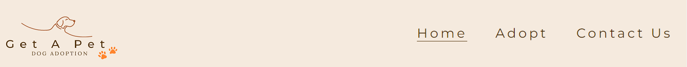

# Get A Pet

Welcome to [Get A Pet dog adoption](https://brindusa22.github.io/get-a-pet/index.html) website! This site hosts the page of a private dog shelter, commited to save dogs from the streets or abusive environments. Its mission is to provide each rescued four legged furry friend with a forever loving home through adoption. You can see details about the shelter and subscribe to its newsletter to receive updated news, on the first page. You can meet the lovely available dogs waiting for their new families, as well as a heartwarming video of successful adoptions, on the [*"Adopt"*](https://brindusa22.github.io/get-a-pet/adopt.html) page. Finally you can become a part of this journey and get in touch with the shelter on the [*"Contact Us"*](https://brindusa22.github.io/get-a-pet/contact-us.html) page.

## Mockup
*** 

The mockup for this site was created with [Balsamiq Wireframes](https://balsamiq.com/wireframes/).

## Layout and Design
***

* The fonts I have used are  *Montserrat* for the headings and *Roboto* for the paragraphs and the rest of the elements. Their compatibility was checked with [Fontpair](https://www.fontpair.co/all).

* I have chosen to use four colors throughout my entire project: a dark brown for the text (#52330a), orange (#ff852e) and a lighter brown for icons (#a6592e), buttons and hover effects, and a pale pastel pink for backgrounds rgb(245, 234, 222). All the colors used were checked with the contrast checker website [WebAIM](https://webaim.org/resources/contrastchecker/) to ensure a very good contrast ratio and therefore provide a good readability and accessibility. For that reason, I have slightly modified the shade of orange to a darker one (#E05D00) for the text-color for both *Subscribe* and *Submit* button, when hovered over. This change does not affect the color harmony and consistency of the site since it is barely noticeable and it was necessary to increase the readability on the pink background .  

* The design of the site was intended to be simple and clean, but at the same time includes patterns such as repetitive icons, interchangeable colors for the hover-over effect and the centered position of the elements on all the pages, that creates consistency and allows the user to navigate intuitively. The header and the footer are present on all pages and have the same design and colors.

### Logo
 The logo of the site was designed with [Canva](https://www.canva.com/design/DAFqTTjRUH4/PY4jYRVwv6xeJcIdyLgqqA/edit).
I have used the same fonts *Montserrat* and *Roboto*, as well as all the four colors used in the project and a combination of elements and patterns, such as small paws, that are present throughout the enire project to create visual consistency.

  

### Images and Icons

* All the images were taken from [Pexels](https://www.pexels.com/search/dogs/) and converted to .webp format using [Cloudconvert](https://cloudconvert.com/).

* The icons were taken from [Fontawesome](https://fontawesome.com/) and their color was customized to match my layout design.
  
* The *Favicon* was created with *Canva*. I then have made its background transparent with [Png Transparency Creator](https://onlinepngtools.com/create-transparent-png) to make it stand out more on the tab and finally converted it with [Favicon Generator](https://favicon.io/favicon-generator/#google_vignette). Again, I have chosen the orange paw to create a repetitive pattern and to enhance consistency and a user friendly design.

    
    

## Features
***

### Existing Features

- Navigation Bar:
  
  
   * By clicking the *Logo* the user will pe taken to the *Home* page.
  
   * The Navigation Bar is present on all the pages to help the user navigate easily. The links have a bottom border when hovered over to give the user a visual hint.
  
   * The Navigation Bar is fully responsive. It changes its layout according to the size of the device. On medium screens the navigation links go under the logo moving together at the center of the page. On smaller screens the navigation links collaps into a burger button. When clicked, it displays the navigation links that stack on top of each other on a semi-trasparent background that has a seethrough effect and alowes the user to still see the general layout of the page:
  
      
      
  
  
- Hero Image and Cover Text:

    
    
    * The hero image has the purpose to capture the attention of the visitors, to create emotional impact and connection and to convey compassion for the abandoned dogs. It creates a friendly and welcoming environment. At the same time it reveals the main purpose of the website:the adoption of dogs.
  
    * The overlaying text has a strong, emotional message and it also includes a **Call to Action** phrase. *SAVE A LIFE!*  is actually a clickable link that takes the visitor on the *Adopt* page, where the available dogs are showcased. The clikable link has also a visual hint, it is underlined and when hovered over, the color changes to orange and a paw icon appears. 
  
    * Under the hero image a background color was added to allow the users to still see the cover text if the image does not load. I chose the same background color that I used for the header and the footer, to maintain continuity and coherence throughout the layout.

    * For medium and smaller screens the cover text moves to the bottom of the hero image and reduces its font-size to maintain a clean and proportional aspect of the image. Also, for the small screen sizes the hover-over effect is canceled since the user no longer uses a mouse.

- About-us Section:
  
    
    
    * This section is intended to briefly present to story of the shelter and its mission in two separate paragraphs, each of them introduced by an orange paw to create consistency and visual clues.
  
    * The *Design Bar* that follows the about us section was created from the hero image. By repeatig a small part from the hero image, I wanted to convey a sense of unity, symmetry and conection between the about-us story and the image. At the same time it acts like a horizontal rule and separates the about-us section from the *Newsletter* section.
  
    * The *Newsletter* section is an interactive section where the visitor is encouraged to subscribe to receive the latest news about dogs and events. The email field will convey an error message if sumbmitted empty or with an invalid property.

- Footer: 

    

    * The footer includes the three social media links that the shelter uses.
  
    * The icons change their color when hovered over to convey a visual hint and encourage the user to click them. The links open into a separate tab.
  
    * A copyright paragraph was included.

- Dog Grid Gallery:

    

    * To showcase the available dogs I have used a grid layout that keeps the structure of the page neat, symmetric and well orderd and also facilitates the responsive design. For large screen size the page displays three columns, for medium screens two and finally, for smaller screens the images are ordered into only one column. 
  
    * Each image has an information box below it, that contains important information about the dogs, such as name, age, sex, weight, breed and personality.These are introduced by suggestive icons, for readability, to help the user find the information quickly without having to read, for aesthetic reasones, to reduce space, but also to create a sense of familiarity and happiness.
  
    * Each grid item is emphasized by an orange border when hovered over.
  
- Happy stories youtube video:
  
  

    * Below the availale dogs, there is a section with an emotional youtube video, presenting the priceless reaction of greateful adopted dogs together with their new happy and loving family. Including this happy stories video, with a joyful music backgroung when played, I wanted to create a sense of positivity and make an emotional appeal to the visitors of the site and encourage them to adopt one of the dogs from the shelter.
  
    * I have added an orange border to the video to make its design similar to the grid items,which have the same border when hovered over. What I also found to be a nice touch is that the subtitles from the video have also orange in addition to white and this was a nice coincidence that makes the video match not only to the content of the page, but also to its design.
  
- Contact-Us page:
  
  

    * This page conatins a suggestive picture and a contact form. The input fields as well as the submit button change their border and background color when hovered hover to match the main colors of the layout for consistency. All elements in the form have the same width including the submit button, because I wanted to give a uniform and sleek appearance to the form. At the same time, emphasizing the submit button, makes it more visible, more accessible and may encourage the visitor to actually use the form.
  
    * All the input elements on the page, as well as the picture have a border-radius applied, for visual cohesion and to create a smoother appearence and a fiendly environment.
   
    * This page is responsive as well and changes its layout to make the form more visible and accessible, maintaining also the important role of the picture and the message it conveys:

         

### Future Features 

  * A page for donations with the possibility to choose between single or multiple donations and the frequency of donations (if applicable), or even the possibility to virtually adopt a particular dog and cover the expenses for its care, until it is actually adopted. 
  
  * A separate page for each dog, which opens in a separate tab when clicking on the photo, that gives more details about each dog and presents its story, and also offers the possibility to send the request for adoption directy on that particular page.
  
  * Being an imaginary shelter, I have not provided any address, but in a real life situation, I would include the address with embeded google maps, as well as the visiting program and a phone number. 

## Edits
***

* During the development of this project I have made some changes in the approach of the implementation of my layout ideas. In the begining I have used the float property for the header and the contact page, but as the work on my project was advancing, I have discovered that this approach was tedious and unproductive, for what I was trying to achieve, so I have changed it, using the flexbox model. This enabled me to obtain easier the desired result and to be able to create the layout changes for the responsive design effortless. 

* During the entire project I have played around with different layout options, experimenting and changing the style of some elements, including the font-size, or the size of the input elements, in order to improve the design and the accessibility.  Whenever I have made such a change, I was always aware of the consistency and symmetry of my layout and I have implemented that change to all the similar elements, to maintain the harmony of the site. All the changes can be tracked in my commit history.  

## Testing
***
The website was tested on Chrome and Safari browsers, on laptop, tablet and mobile phone. I have also tested it on a wide screen 21:9 and the layout adapts to it nicely as well. 

The breakpoints for the media queries that I have set, allows the layout to transform and to fit perfectly on each type of screen maintaining its aspect ratio and design.

### Lighthouse

The reports generated by *Lighthouse* are the following:

### Validator Testing

* HTML: 
  
  Only minor errors were found with the W3C Validator, such as typos and accidentally generated extra closing tags. These were fixed and the validator showed no errors afterwards.
  
  
  
* CSS:

  No errors were found.

  

### Fixed issues

* One issue that I have only noticed on a wider screen 21:9, was that the image on the contact-us page was not maintaining its aspect ratio. It was stretching, from heading to the footer, ocupying the white margings that I had set. This problem was solved after changing the display propetry of the div containing the image and the form, from inline to flex. That still displayed the image and the form next to each other, but adding some flex properties and a max-width, I managed to make the image and the form grow and shrink symmetrically and proportional on each screen width, including the wide screen, mainteining their aspect-ratio.

* When I added the hover-over effect to the grid gallery items (which contain each 2 divs: the image and the description box), namely the orange border, I have noticed that the images would zoom out a bit, overlap the border and have a double border. After checking with *DevTools* activating and deactivating various properties, I have realized that the problem was caused by the property *border: 5px solid #ff852e* that I set for the grid item when hovered over. The images were supposed to have no border and the grid item was already having a border. I only wanted to add the change of color effect for the item border, when hovered over and this property was somehow adding an extra border to the image only. So I have replaced that property with *border-color: #ff852e* and it worked.

* I wanted to increase the  83 *Lighthouse* *Best Practices* score for the *Adopt* page. One of the suggestions that it gave me for that was to add width and height properties to all the img elements from that page, including the logo image. I did so for the logo first, to try it and the score increased indeed, but on small screens 750px wide and below, the header started to behave very strange, moving on top of the logo, together with the burger button amd decreasing its height. Since for the small screens the header has a fixed position, I imagined that this bug has to do with the width and height properties that I had given to the logo img element. So  I have removed the width and height properties and everything was normal again.

### Unfixed issues

There were no unfixed issues left.

## Deployment
***

* The site was deployed to GitHub Pages. The steps to deploy are as follows:
  
  * In the GitHub repository, navigate to the Settings tab
  * Navigate to the Pages section that you find on the left side of the screen
  * From the Branch section drop-down menu select the Main Branch 
  * Once the main branch has been selected, the page was automatically refreshed with a detailed ribbon display to indicate the successful deployment.

 The live link can be found here: https://brindusa22.github.io/get-a-pet/
 

 ## Credits
 ***
 
 ### Media 
 
  * All the photos were taken from [Pexels](https://www.pexels.com/search/dogs/).
  
  * The logo was created with [Canva](https://www.canva.com/design/DAFqTTjRUH4/PY4jYRVwv6xeJcIdyLgqqA/edit).

  * The icons were taken from [Fontawesome](https://fontawesome.com/).

  * The embeded video is from YouTube: [Video](https://www.youtube.com/watch?v=7Zxm2wcgeYI).
  
  * The fonts were imported from [Google Fonts](https://fonts.google.com/).
 
 ### Implementation

* Explanations on how to implement the grid gallery I found [here](https://developer.mozilla.org/en-US/docs/Web/CSS/CSS_grid_layout/Basic_concepts_of_grid_layout#gutters).

* I have read more about the Flexbox model [here](https://css-tricks.com/snippets/css/a-guide-to-flexbox/#aa-flexbox-properties).
  
* I have done more reaserch abut the burger button without JavaSript [here](https://blog.logrocket.com/create-responsive-mobile-menu-with-css-no-javascript/).
  
### Content

  I have found design inspiration on these websites:
   
   <https://uk.rolda.org/adopt-a-dog/>

   <https://animalhaven.org/adopt/dogs/>

   <https://www.animal-happyend.ch/die-hunde/alle-hunde>

## Acknowledgments
***
I would like to express my gratitude and a special tanks to my mentor Rahul Lakhanpal, for supporting and encouraging me and for his good advice and suggestions that helped me improve my project.

   
