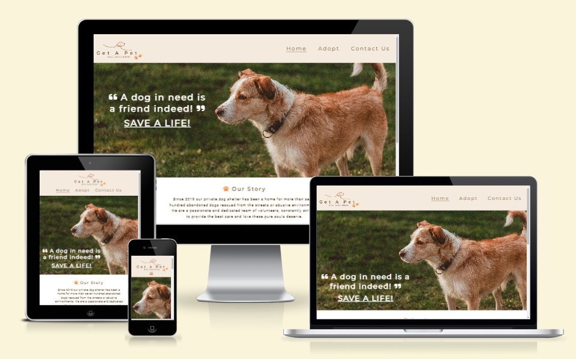
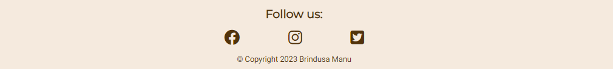

# Get A Pet

Welcome to [Get A Pet dog adoption](https://brindusa22.github.io/get-a-pet/index.html) website! This site hosts the page of a private dog shelter, commited to save dogs from the streets or abusive environments. Its mission is to provide each rescued four legged furry friend with a forever loving home through adoption. You can see details about the shelter and subscribe to its newsletter to receive updated news, on the first page. You can meet the lovely available dogs waiting for their new families, as well as a heartwarming video of successful adoptions, on the [*"Adopt"*](https://brindusa22.github.io/get-a-pet/adopt.html) page. Finally you can become a part of this journey and get in touch with the shelter on the [*"Contact Us"*](https://brindusa22.github.io/get-a-pet/contact-us.html) page.

## Mockup
*** 

The mockup for this site was created with [Balsamiq Wireframes](https://balsamiq.com/wireframes/).

## Layout and Design
***

* The fonts I have used are  *Montserrat* for the headings and *Roboto* for the paragraphs and the rest of the elements. Their compatibility was checked with [Fontpair](https://www.fontpair.co/all).

* I have chosen to use four colors throughout my entire project: a dark brown for the text (#52330a), orange (#ff852e) and a lighter brown for icons (#a6592e), buttons and hover effects, and a pale pastel pink for backgrounds rgb(245, 234, 222). All the colors used were checked with the contrast checker website [WebAIM](https://webaim.org/resources/contrastchecker/) to ensure a very good contrast ratio and therefore provide a good readability and accessibility. For that reason, I have slightly modified the shade of orange to a darker one (#E05D00) for the text-color for both *Subscribe* and *Submit* button, when hovered over. This change does not affect the color harmony and consistency of the site since it is barely noticeable and it was necessary to increase the readability on the pink background .  

* The design of the site was intended to be simple and clean, but at the same time includes patterns such as repetitive icons, interchangeable colors for the hover-over effect and the centered position of the elements on all the pages, that creates consistency and allows the user to navigate intuitively. The header and the footer are present on all pages and have the same design and colors.

### Logo
 The logo of the site was designed with [Canva](https://www.canva.com/design/DAFqTTjRUH4/PY4jYRVwv6xeJcIdyLgqqA/edit).
I have used the same fonts *Montserrat* and *Roboto*, as well as all the four colors used in the project and a combination of elements and patterns, such as small paws, that are present throughout the enire project to create visual consistency.

  

### Images and Icons

* All the images were taken from [Pexels](https://www.pexels.com/search/dogs/) and converted to .webp format using [Cloudconvert](https://cloudconvert.com/).

* The icons were taken from [Fontawesome](https://fontawesome.com/) and their color was customized to match my layout design.
  
* The *Favicon* was created with *Canva*. I then have made its background transparent with [Png Transparency Creator](https://onlinepngtools.com/create-transparent-png) to make it stand out more on the tab and finally converted it with [Favicon Generator](https://favicon.io/favicon-generator/#google_vignette). Again, I have chosen the orange paw to create a repetitive pattern and to enhance consistency and a user friendly design.

    
    

## Features
***

### Existing Features

- Navigation Bar:
  
  
   * By clicking the *Logo* the user will pe taken to the *Home* page.
  
   * The Navigation Bar is present on all the pages to help the user navigate easily. The links have a bottom border when hovered over to give the user a visual hint.
  
   * The Navigation Bar is fully responsive. It changes its layout according to the size of the device. On medium screens the navigation links go under the logo moving together at the center of the page. On smaller screens the navigation links collaps into a burger button. When clicked, it displays the navigation links that stack on top of each other on a semi-trasparent background that has a seethrough effect and alowes the user to still see the general layout of the page:
  
      
      
  
  
- Hero Image and Cover Text:

    
    
    * The hero image has the purpose to capture the attention of the visitors, to create emotional impact and connection and to convey compassion for the abandoned dogs. It creates a friendly and welcoming environment. At the same time it reveals the main purpose of the website:the adoption of dogs.
  
    * The overlaying text has a strong, emotional message and it also includes a **Call to Action** phrase. *SAVE A LIFE!*  is actually a clickable link that takes the visitor on the *Adopt* page, where the available dogs are showcased. The clikable link has also a visual hint, it is underlined and when hovered over, the color changes to orange and a paw icon appears. 
  
    * Under the hero image a background color was added to allow the users to still see the cover text if the image does not load. I chose the same background color that I used for the header and the footer, to maintain continuity and coherence throughout the layout.

    * For medium and smaller screens the cover text moves to the bottom of the hero image and reduces its font-size to maintain a clean and proportional aspect of the image. Also, for the small screen sizes the hover-over effect is canceled since the user no longer uses a mouse.

- About-us Section:
  
    
    
    * This section is intended to briefly present to story of the shelter and its mission in two separate paragraphs, each of them introduced by an orange paw to create consistency and visual clues.
  
    * The *Design Bar* that follows the about us section was created from the hero image. By repeatig a small part from the hero image, I wanted to convey a sense of unity, symmetry and conection between the about-us story and the image. At the same time it acts like a horizontal rule and separates the about-us section from the *Newsletter* section.
  
    * The *Newsletter* section is an interactive section where the visitor is encouraged to subscribe to receive the latest news about dogs and events. The email field will convey an error message if sumbmitted empty or with an invalid property.

- Footer: 

    

    * The footer includes the three social media links that the shelter uses.
  
    * The icons change their color when hovered over to convey a visual hint and encourage the user to click them. The links open into a separate tab.
  
    * A copyright paragraph was included.

- Dog Grid Gallery:

    

    * To showcase the available dogs I have used a grid layout that keeps the structure of the page neat, symmetric and well orderd and also facilitates the responsive design. For large screen size the page displays three columns, for medium screens two and finally, for smaller screens the images are ordered into only one column. 
  
    * Each image has an information box below it, that contains important information about the dogs, such as name, age, sex, weight, breed and personality.These are introduced by suggestive icons, for readability, to help the user find the information quickly without having to read, for aesthetic reasones, to reduce space, but also to create a sense of familiarity and happiness.
  
    * Each grid item is emphasized by an orange border when hovered over.
  
- Happy stories youtube video:
  
  

    * Below the availale dogs, there is a section with an emotional youtube video, presenting the priceless reaction of greateful adopted dogs together with their new happy and loving family. Including this happy stories video, with a joyful music backgroung when played, I wanted to create a sense of positivity and make an emotional appeal to the visitors of the site and encourage them to adopt one of the dogs from the shelter.
  
    * I have added an orange border to the video to make its design similar to the grid items,which have the same border when hovered over. What I also found to be a nice touch is that the subtitles from the video have also orange in addition to white and this was a nice coincidence that makes the video match not only to the content of the page, but also to its design.

